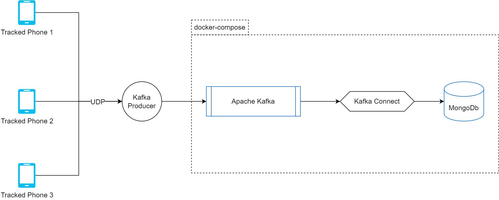

# realtime-gps-tracker-etl
This is a simplified version of an architecture that can handle realtime GPS data using Kafka and MongoDB.

### Architecture



# Requirements
- Python3.6+
- Docker


# Install
### install python requirements
```bash
pip install -r requirements.txt
```
### build docker services
```bash
docker-compose build
```

# Run
### 1 - Spin up the infrastructure
```bash
docker-compose up
```

### 2.a - Create the Sink Connector between Kafka and MongoDb
```bash
python create-sink.py
```

### 2.b - If you want to delete the connector
```bash
python delete-sink.py
```

### 3.a - Push data to Kafka
```bash
python udp_producer.py
```

### 3.b - Keep an eye on what's pushed to the Kafka topic
```bash
python consumer.py
```


### 4 - check Mongodb To see the Data
You can view the data being stored in MongoDb in many ways. I prefer the following :
- UI : use Mongodb Compass to connect to the container and see it in the user interface
- Python : read it using pymongo.